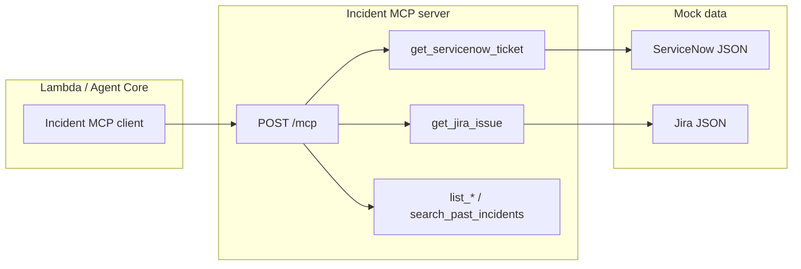

# Incident MCP Tools

MCP server for incident tools: **mock ServiceNow**, **mock Jira**, and a stub for **past incidents** (knowledge base). Uses the same HTTP bridge contract as the Log MCP server (`POST /mcp` with `method` + `params`).

## Tools

| Method | Description |
|--------|-------------|
| `get_servicenow_ticket` | Get one ServiceNow incident by number (e.g. `INC001`). Params: `ticket_number` |
| `list_servicenow_tickets` | List tickets. Params: `service`, `category`, `limit` (optional) |
| `get_jira_issue` | Get one Jira issue by key (e.g. `PAY-101`). Params: `issue_key` |
| `list_jira_issues` | List issues. Params: `project`, `service`, `limit` (optional) |
| `search_past_incidents` | Stub for KB (returns empty list until connected to DynamoDB) |

## Sample data

- **ServiceNow:** 6 mock tickets (payment-service, rating-service, policy-service).
- **Jira:** 6 mock issues (PAY-101/102, RAT-201/202, POL-301/302).

Data lives in `src/incident_mcp_server/mock_data/` (JSON files).

## Run locally

```bash
cd mcp-incident-tools
pip install -e .
# From repo root so src is on path:
cd ..
uvicorn mcp-incident-tools.src.incident_mcp_server.server:http_app --host 0.0.0.0 --port 8010
# Or from mcp-incident-tools with PYTHONPATH=src:
PYTHONPATH=src uvicorn incident_mcp_server.server:http_app --host 0.0.0.0 --port 8010
```

Or:

```bash
cd mcp-incident-tools
pip install -e .
python -m incident_mcp_server.server
# (if run from mcp-incident-tools and src is not the package root, use PYTHONPATH=src)
```

## Health and MCP endpoint

- `GET /health` → `{"status": "healthy", "service": "incident-mcp-tools"}`
- `POST /mcp` → Body: `{"method": "get_servicenow_ticket", "params": {"ticket_number": "INC001"}}`

## Diagram



## License

Same as the parent Agentic SRE project.
